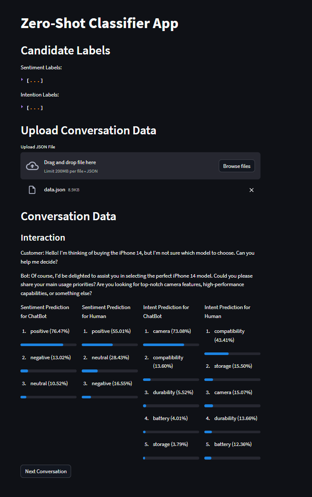
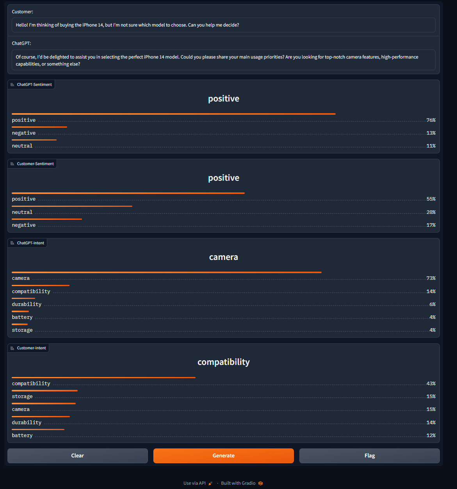

# SentimentGPT
Zero-shot sentiment &amp; intent analysis with LLMs


## About
Perform sentiment and intent analysis with pre-trained LLMs. 
The repo is intentionally built to keep pre-trained LLMs model files in local file system.

An example of `sentimentgpt` python-package usage (run after [installation](#installation)):

```Python
from sentimentgpt.classifier import PipelineSIGPT

# Define candidate labels for both sentiment and intention
candidate_labels_sentiment = ['positive', 'neutral', 'negative']
candidate_labels_intention = ['compatibility', 'durability', 'storage', 'battery', 'camera']
config_zs = {
    "candidate_labels_sentiment":candidate_labels_sentiment,
    "candidate_labels_intention":candidate_labels_intention}
pipe_sigpt = PipelineSIGPT(config_zs)

# load offline-conversation data: data/data.json
conversations = {}
with open("data\data.json") as json_file:
    conversations = json.load(json_file)["conversation"]
    json_file.close()

# Load the first interaction between human-chatbot
conv = pipe_sigpt.analyze_interaction(conversations[0])
```

```bash
> Output:
{'sentence': {'customer': "Hello! I'm thinking of buying the iPhone 14, but I'm not sure which model to choose. Can you help me decide?",
  'bot': "Of course, I'd be delighted to assist you in selecting the perfect iPhone 14 model. Could you please share your main usage priorities? Are you looking for top-notch camera features, high-performance capabilities, or something else?"},
 'intent_bot': {'labels': ['camera',
   'compatibility',
   'durability',
   'battery',
   'storage'],
  'scores': [0.7308412790298462,
   0.1360185444355011,
   0.055183712393045425,
   0.04009850695729256,
   0.037857890129089355]},
 'intent_customer': {'labels': ['compatibility',
   'storage',
   'camera',
   'durability',
   'battery'],
  'scores': [0.4340726435184479,
   0.15499922633171082,
   0.15069378912448883,
   0.13660714030265808,
   0.12362721562385559]},
 'sentiment_customer': {'labels': ['positive', 'neutral', 'negative'],
  'scores': [0.5501211285591125, 0.28433698415756226, 0.16554193198680878]},
 'sentiment_bot': {'labels': ['positive', 'negative', 'neutral'],
  'scores': [0.7646854519844055, 0.13015080988407135, 0.10516374558210373]}}
```


## For More Information About Zero-Shot Learning and Deployment

- Zero-Shot Learning: [ZeroShot.md](ZeroShot.md)

- Integrating speech-to-text using gRPC [SpeechToTextGRPC.md](SpeechToTextGRPC.md)


## Installation

### Installing sentimentgpt as Python Package
```bash
pip install -e .
```

### Install requirements
```bash
pip install -r requirements.txt
```
### Download facebook/bart-large-mnli model
Zero-shot classification uses 

1. Download model files from Huggingface model hub: https://huggingface.co/facebook/bart-large-mnli/tree/main
2. Copy model checkpoint'pytorch_model.bin' to resources/ folder.
3. Copy following config files to `config/` folder:
    - config.json
    - tokenizer.json
    - tokenizer_config.json
    - vocab.json

## Generating Data
Data is generated by the following Chatgpt prompt:
```text
Create a dataset in json format for a customer representative chatbot and human interaction that lasts 25 steps. 

Human wants to buy Iphone 14 and the chatbot interacts with him  
```

- Generate data with prompt: `data/data.json`

- Annotated Conversation with Intent&Sentiment Candidate Labels: `data/data_result.json`

## Streamlit App
Upload conversation prompt (data.json) and analysis would be shown up.

```bash
streamlit run app.py
```

App will be running at LOCAL URL: http://127.0.0.1:7860

`Note: Click **Generate** button to start the app`

<!--  -->


## Gradio App
Modify `app.py` script's `data_file` variable with correct name of json file `(e.g.data/data.json)`. 

```bash
python app.py
```

App will be running at LOCAL URL: http://127.0.0.1

`Note: Click **Generate** button to start the app`

<!--  -->



## todo-list: 
- speech2text API