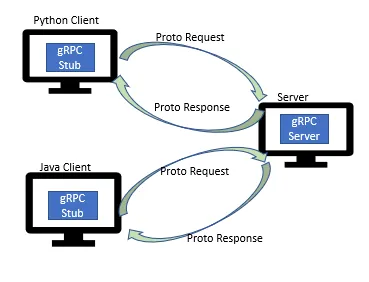

# Integration of Speech-To-Text with gRPC Framework

Integrating a speech-to-text (STT) API into our zero-shot classification package using gRPC is a powerful way to enhance the application in the future.

However, there may be several challenges the application might face.
I will dig into those potential challenges:

## Main Challenges

### 1. Latency and Performance

- gRPC benefits from a robust and engaged community, and its performance has been rigorously tested across demanding scenarios. 

Though, there might still be challenges with latency and performance systems with gRPC APIs:

#### Latency in Python gRPC: Global Interpreter Lock (GIL)

- The Python implementation of gRPC contends with the Global Interpreter Lock (GIL), which permits only one thread to execute at a time, BentoML addresses this constraint through an architectural approach. 

- It achieves this by orchestrating multiple instances of gRPC servers, equivalent to the available CPU cores, leveraging the hardware for optimal parallelism. 

#### Binary Encoding Feature

- Empirical evaluations highlight that gRPC outperforms its REST counterpart by a substantial margin(7 times), demonstrating multiple-fold improvements in speed. 

- Moreover, when utilizing **binary encoding**, structured data payloads such as tensors and tabular structures exhibit a 30% reduction in size with gRPC in comparison to JSON-based REST. 

### 2. Delay in Data Transmission

- The time it takes to send audio data to the STT API and receive the transcribed text back could introduce delays in the classification system.

### 3. Network Reliability

- Since gRPC operates over networks, one need to consider potential network disruptions or failures. 
- If the connection between the application and the STT API is not reliable, it could lead to incomplete or delayed transcriptions.

### 4. Slower Implementation Than REST

- While this approach offers advantages in terms of message transmission speed, it is worth noting that this specific API implementation tends to exhibit slower performance compared to a REST API implementation. 

- Crafting a basic gRPC Service demands approximately 45 minutes, whereas setting up a Web or REST API can be accomplished in approximately 10 minutes. This consideration holds significance when deciding the optimal choice for your system.

### 5. Slower Speed Than REST

- In general, REST APIs most used for building microservices-based infrastructures.
Any time you plan to build an app or a larger computer system that requires connecting microservices, REST is the most common choice rather than gRPC.

- REST APIs are also best for systems that require speed. If you need standardized HTTP protocol, high-speed iteration, and multi-language microservices connected, then REST should be your main choice. 

- REST APIs also have universal support with third-party tools, so are ideal for everything from apps to web services.

### 6. Data Privacy and Security

- Transmitting sensitive data over the network could raise privacy and security concerns.
- Making sure the STT API and the communication channel are properly secured, and considering the implications of sharing potentially sensitive audio data is a key challenge.

### 7. API Rate Limits and Costs

- Most APIs have rate limits and usage quotas to prevent abuse.
- Depending on the rate at which you process audio, you might encounter API rate limiting issues.
- Additionally, using an STT API could incur costs based on usage, so it's important to factor in the financial implications.

